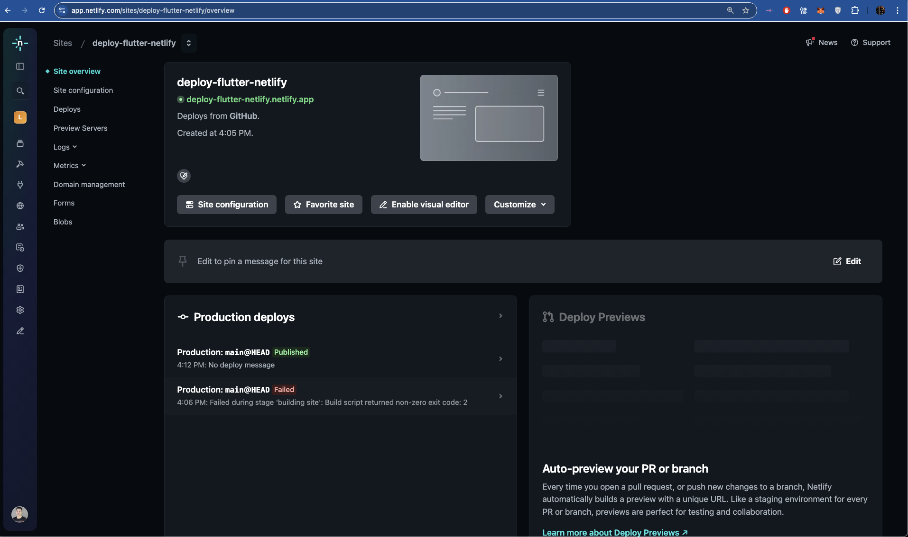

# Introduction

Deploy a Flutter web application to Netlify. Work around Netlify's lack of default Flutter support by adding two configurations to a Netlify's site configuration > Build & Deploy > Build Settings.

Specifically:

- Build Command: `if cd flutter; then git pull && cd ..; else git clone https://github.com/flutter/flutter.git; fi && flutter/bin/flutter config --enable-web && flutter/bin/flutter build web --release`
- Build Directory: `build/web`

## Setup

- git clone
- cd directory
- flutter pub get
- flutter run -d chrome
